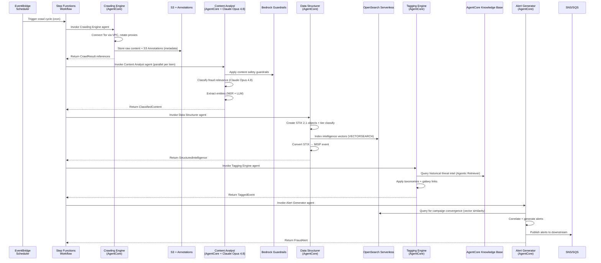
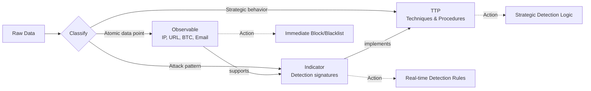

# Design Document: Dark Web Fraud Agent

## Overview

This document defines the technical design for an agentic dark web research system that autonomously crawls dark web sources, applies AI-driven content analysis, structures findings into industry-standard formats (STIX 2.1 and MISP), and generates actionable banking fraud intelligence alerts.

The system uses a fully AWS-native multi-agent architecture built on **Amazon Bedrock AgentCore** (GA, AWS Summit NY 2026) where five specialized agents operate as an intelligence pipeline orchestrated by **AWS Step Functions**: Crawling Engine → Content Analyst → Data Structurer → Tagging Engine → Alert Generator. Each agent is defined declaratively via AgentCore Harness configuration (model, tools, skills, instructions) with no orchestration loop coding required.

### Key Design Decisions

| Decision | Choice | Rationale |
|----------|--------|-----------|
| Agent Framework | Amazon Bedrock AgentCore Harness | GA at Summit NY 2026. Declarative agent definition (model, tools, skills, instructions). No orchestration loop coding. Native AWS integration. |
| LLM Backbone | Claude Opus 4.8 on Amazon Bedrock | Most capable Anthropic model, purpose-built for agentic coding and extended autonomous tasks. Available on Bedrock. |
| Pipeline Orchestration | AWS Step Functions + AgentCore Integration | Add AI agent reasoning steps to Step Functions workflows. Run agents in parallel/sequence with human approval checkpoints. |
| RAG / Knowledge Base | AgentCore Managed Knowledge Base | Fully managed RAG pipeline with Smart Parsing for multi-format dark web data. Agentic Retriever for complex multi-step queries over historical threat intel. |
| Vector Search / Correlation | Amazon OpenSearch Serverless (Next Gen for Agentic AI) | Purpose-built for agentic AI. Scales 0→thousands RPS, GPU acceleration. VECTORSEARCH collection type for threat intel similarity search. |
| Raw Artifact Storage | Amazon S3 + S3 Annotations | Store raw crawl artifacts in S3. Attach up to 1 GB of rich, queryable context (intelligence metadata) directly to each S3 object via Annotations. |
| Credential Management | AWS Secrets Manager (AgentCore BYO Secrets) | Reference Secrets Manager ARNs for Tor proxy credentials, MISP API keys. AgentCore Identity integration. |
| Content Safety | AgentCore Policy Integrations (Bedrock Guardrails) | Prompt injection detection, harmful content filtering, sensitive data detection when processing dark web material. |
| Agent Optimization | AgentCore Optimization | Production trace analysis: failure, intent, and trajectory insights. A/B testing for agent performance improvement. |
| Monitoring | Amazon Bedrock CloudWatch Metrics + CloudWatch | Token counts, client error rates, custom dashboards, and alerting. |
| Security Posture | AWS Continuum | AI-native security. Continuum Threat Modeling generates STRIDE threat models for the agent system itself. |
| Web Grounding | AgentCore Web Search | Fully managed grounding tool. Zero data egress from customer AWS environment. |
| Scheduling / Events | Amazon EventBridge | Cron-based crawl scheduling and event routing between services. |
| Agent State | Amazon DynamoDB | Agent configuration, crawl state tracking, convergence windows for campaign detection. |
| Alert Distribution | Amazon SNS/SQS | Fan-out alerts to downstream fraud detection systems. |
| Network Isolation | Amazon VPC | Isolated VPC for Tor proxy infrastructure (NAT Gateway → Tor SOCKS5 proxies on EC2/Fargate). |
| Data Standards | cti-python-stix2 + PyMISP | Official OASIS library for STIX 2.1; PyMISP for MISP REST API integration |
| Fraud Taxonomy | MITRE ATT&CK + MITRE F3 (Fight Fraud Framework) | F3 extends ATT&CK with fraud-specific techniques |

## Architecture

### High-Level System Architecture

```mermaid
graph TB
    subgraph "Dark Web Sources"
        TOR[Tor Hidden Services]
        I2P[I2P Network]
        TG[Telegram Channels]
        FORUMS[Dark Web Forums]
        MKT[Illicit Marketplaces]
    end

    subgraph "AWS Agent Pipeline"
        direction TB
        SF[AWS Step Functions<br/>Pipeline Orchestrator]
        CE[Crawling Engine<br/>AgentCore Agent]
        CA[Content Analyst<br/>AgentCore Agent]
        DS[Data Structurer<br/>AgentCore Agent]
        TE[Tagging Engine<br/>AgentCore Agent]
        AG[Alert Generator<br/>AgentCore Agent]
    end

    subgraph "AWS Intelligence Infrastructure"
        S3[Amazon S3 + Annotations<br/>Raw Artifacts + Metadata]
        OS[OpenSearch Serverless<br/>VECTORSEARCH Collection]
        KB[AgentCore Managed<br/>Knowledge Base]
        DDB[Amazon DynamoDB<br/>Agent State & Config]
        SM[AWS Secrets Manager<br/>Tor/MISP Credentials]
    end

    subgraph "AWS Compute & Networking"
        VPC[Amazon VPC<br/>Tor Proxy Isolation]
        LAMBDA[AWS Lambda<br/>Lightweight Processing]
        EB[Amazon EventBridge<br/>Scheduling & Routing]
    end

    subgraph "Monitoring & Safety"
        CW[Amazon CloudWatch<br/>Metrics & Alarms]
        GR[Bedrock Guardrails<br/>Content Safety]
        OPT[AgentCore Optimization<br/>Trace Analysis]
        CTM[AWS Continuum<br/>Threat Modeling]
    end

    subgraph "External Integrations"
        MISP_SRV[MISP Instance]
        BEDROCK[Amazon Bedrock<br/>Claude Opus 4.8]
    end

    subgraph "Downstream Consumers"
        SNS[Amazon SNS/SQS<br/>Alert Distribution]
        FDS[Fraud Detection Systems]
        SIEM[SIEM / SOC]
        TIP[Threat Intel Platform]
    end

    TOR --> VPC
    I2P --> VPC
    TG --> VPC
    FORUMS --> VPC
    MKT --> VPC
    VPC --> CE

    SF --> CE
    SF --> CA
    SF --> DS
    SF --> TE
    SF --> AG

    CE --> S3
    CA --> BEDROCK
    CA --> GR
    DS --> OS
    DS --> MISP_SRV
    TE --> KB
    AG --> SNS

    CE --> DDB
    SM --> CE
    SM --> DS
    EB --> SF

    SNS --> FDS
    SNS --> SIEM
    SNS --> TIP

    OPT --> SF
    CW --> SF
    CTM -.-> SF
```



### Agent Pipeline Orchestration Flow (Step Functions + AgentCore)



### AWS Service Interaction Map

| Service | Role | Integration Point |
|---------|------|-------------------|
| Amazon Bedrock AgentCore Harness | Agent runtime — defines model, tools, skills, instructions declaratively | Each pipeline agent is an AgentCore agent |
| Claude Opus 4.8 (Bedrock) | Primary LLM for content analysis, entity extraction, technique categorization | Content Analyst agent's model configuration |
| AgentCore Managed Knowledge Base | RAG over historical threat intelligence corpus | Tagging Engine queries for threat actor matching |
| AgentCore Web Search | Grounding tool for OSINT enrichment | Content Analyst and Alert Generator agents |
| AgentCore Optimization | Production trace analysis, A/B testing | Monitors all agent sessions for improvement |
| AgentCore Policy (Bedrock Guardrails) | Content safety for dark web material | Applied before Content Analyst processes raw text |
| AWS Step Functions | Pipeline orchestration with agent reasoning steps | Sequences agents, handles parallelism, human checkpoints |
| Amazon OpenSearch Serverless | VECTORSEARCH for threat intel similarity and correlation | Data Structurer indexes; Alert Generator queries for campaigns |
| Amazon S3 + S3 Annotations | Raw crawl artifact storage with queryable intelligence metadata | Crawling Engine stores; all agents can query annotations |
| AWS Secrets Manager | Tor proxy credentials, MISP API keys | AgentCore Identity BYO Secrets references |
| Amazon DynamoDB | Agent state, crawl configuration, convergence tracking | All agents read config; Alert Generator tracks convergence windows |
| Amazon EventBridge | Crawl scheduling, event routing | Triggers Step Functions workflows on schedule |
| AWS Lambda | Lightweight processing (deduplication, format conversion) | Utility steps within Step Functions |
| Amazon CloudWatch | Monitoring, alerting, Bedrock inference metrics | All services emit metrics; alarms on error rates |
| Amazon SNS/SQS | Alert distribution to downstream systems | Alert Generator publishes; consumers subscribe |
| Amazon VPC | Network isolation for Tor infrastructure | Crawling Engine runs in isolated subnet with NAT → Tor |
| AWS Continuum | STRIDE threat modeling for the agent system itself | Security posture assessment during development |
| AWS IAM | Fine-grained agent permissions | Each agent has a least-privilege execution role |

## Components and Interfaces

### 1. Crawling Engine Agent (AgentCore)

**Responsibility:** Navigate Tor/I2P networks via VPC-isolated proxies, collect raw content from configured dark web sources, manage proxy rotation and retry logic, store artifacts in S3 with intelligence annotations.

**AgentCore Configuration:**
- **Model:** Claude Opus 4.8 (for adaptive crawl decisions)
- **Tools:** Tor SOCKS5 proxy connector, S3 put + annotate, DynamoDB state read/write
- **Skills:** Circuit rotation, CAPTCHA detection, content extraction
- **Secrets:** Tor proxy credentials via Secrets Manager ARN

**Technology Stack:**
- Amazon Bedrock AgentCore Harness — agent runtime
- Amazon VPC + NAT Gateway — isolated Tor network access
- `stem` (Python Tor controller) running on Fargate task in VPC
- Amazon S3 + S3 Annotations — artifact storage with metadata
- AWS Secrets Manager — proxy credential rotation
- Amazon DynamoDB — crawl state and source configuration

**Interface:**

```python
@dataclass
class CrawlResult:
    source_url: str
    source_category: str  # "forum" | "marketplace" | "telegram" | "paste"
    raw_content: str
    crawl_timestamp: datetime
    proxy_identity: str
    response_status: int
    content_hash: str  # SHA-256 for deduplication
    s3_artifact_key: str  # S3 key for raw artifact
    s3_annotation_id: str  # S3 Annotation ID with metadata

class CrawlingEngine:
    """AgentCore agent with Tor proxy tools."""
    def __init__(self, config: CrawlConfig) -> None: ...
    async def start(self) -> None: ...
    async def stop(self) -> None: ...
    async def crawl_source(self, source: SourceDefinition) -> CrawlResult: ...
    async def rotate_circuit(self) -> str: ...  # Returns new exit node IP
    async def store_artifact(self, content: str, metadata: dict) -> tuple[str, str]: ...
    def get_health(self) -> AgentHealth: ...

@dataclass
class SourceDefinition:
    url: str
    source_type: str  # "onion" | "i2p" | "telegram" | "clearnet"
    category: str
    crawl_interval_seconds: int
    requires_auth: bool
    secret_arn: Optional[str]  # AWS Secrets Manager ARN for auth

@dataclass
class CrawlConfig:
    sources: list[SourceDefinition]
    tor_socks_port: int  # default 9050
    tor_control_port: int  # default 9051
    max_retries: int  # default 3
    circuit_rotation_interval: int  # seconds
    request_timeout: int  # seconds
    s3_bucket: str  # Artifact storage bucket
    dynamodb_table: str  # State tracking table
    secrets_manager_prefix: str  # Prefix for credential ARNs
```

### 2. Content Analyst Agent (AgentCore + Claude Opus 4.8)

**Responsibility:** Classify raw content for fraud relevance, extract structured entities, assign severity scores, and flag low-confidence items for review. Applies Bedrock Guardrails before processing dark web content.

**AgentCore Configuration:**
- **Model:** Claude Opus 4.8 (extended autonomous reasoning for nuanced fraud language)
- **Tools:** S3 Annotations reader, entity extraction NER, severity scorer
- **Skills:** Fraud classification, technique categorization, entity extraction
- **Guardrails:** Bedrock Guardrails for prompt injection, harmful content, sensitive data detection
- **Knowledge Base:** AgentCore Managed KB for historical fraud pattern context

**Technology Stack:**
- Amazon Bedrock AgentCore Harness — agent runtime
- Claude Opus 4.8 on Amazon Bedrock — primary LLM
- AgentCore Policy Integrations (Bedrock Guardrails) — content safety
- AgentCore Web Search — OSINT enrichment (zero egress)
- Custom NER via Lambda — structured entity extraction (BINs, SWIFT codes, wallets)

**Interface:**

```python
@dataclass
class ClassifiedContent:
    source_ref: str  # S3 artifact key reference
    is_fraud_relevant: bool
    confidence: float  # 0.0 to 1.0
    requires_manual_review: bool
    severity_score: int  # 1-10
    fraud_category: Optional[str]  # MFA bypass, synthetic identity, etc.
    entities: list[ExtractedEntity]
    raw_text_snippet: str  # First 500 chars for context
    bedrock_guardrail_result: str  # "PASSED" | "FILTERED" | "FLAGGED"

@dataclass
class ExtractedEntity:
    entity_type: str  # "bank_name" | "bin_range" | "swift_code" | "btc_wallet" | "email" | "url" | "ip_address"
    value: str
    context: str  # surrounding text
    confidence: float

class ContentAnalyst:
    """AgentCore agent with Claude Opus 4.8 and Bedrock Guardrails."""
    def __init__(self, config: AnalystConfig) -> None: ...
    async def analyze(self, crawl_result: CrawlResult) -> ClassifiedContent: ...
    async def classify_relevance(self, text: str) -> tuple[bool, float]: ...
    async def extract_entities(self, text: str) -> list[ExtractedEntity]: ...
    async def categorize_technique(self, text: str) -> Optional[str]: ...
    def assign_severity(self, classification: ClassifiedContent) -> int: ...
    def get_health(self) -> AgentHealth: ...

@dataclass
class AnalystConfig:
    bedrock_model_id: str  # "anthropic.claude-opus-4-8-20260601-v1:0"
    guardrail_id: str  # Bedrock Guardrail ARN
    knowledge_base_id: str  # AgentCore Managed KB ID
    confidence_threshold: float  # 0.7 default
    s3_bucket: str
```

### 3. Data Structurer Agent (AgentCore)

**Responsibility:** Convert classified entities into valid STIX 2.1 objects, manage MISP event creation, classify intelligence into tiers, index vectors into OpenSearch Serverless, and maintain referential links.

**AgentCore Configuration:**
- **Model:** Claude Opus 4.8 (for complex relationship inference)
- **Tools:** STIX 2.1 builder, MISP API client, OpenSearch indexer, S3 Annotations reader
- **Skills:** STIX object creation, MISP mapping, tier classification, vector embedding
- **Secrets:** MISP API key via Secrets Manager ARN

**Technology Stack:**
- Amazon Bedrock AgentCore Harness — agent runtime
- Amazon OpenSearch Serverless (VECTORSEARCH) — threat intel vector indexing and similarity search
- `stix2` (cti-python-stix2) — STIX 2.1 object creation and validation
- `pymisp` — MISP event management via REST API
- Amazon Bedrock Embeddings — generate vector embeddings for intelligence items

**Interface:**

```python
@dataclass
class StructuredIntelligence:
    stix_bundle: stix2.Bundle
    misp_event_id: Optional[str]
    tier: IntelligenceTier
    referential_links: list[TierLink]
    opensearch_doc_ids: list[str]  # Indexed document IDs in OpenSearch

class IntelligenceTier(Enum):
    OBSERVABLE = "observable"   # Atomic data points — immediate blocking
    INDICATOR = "indicator"     # Attack patterns — real-time detection rules
    TTP = "ttp"                 # Strategic behaviors — long-term detection logic

@dataclass
class TierLink:
    source_id: str
    source_tier: IntelligenceTier
    target_id: str
    target_tier: IntelligenceTier
    relationship_type: str  # "derived-from" | "supports" | "indicates"

class DataStructurer:
    """AgentCore agent with OpenSearch and MISP tools."""
    def __init__(self, config: StructurerConfig) -> None: ...
    async def structure(self, content: ClassifiedContent) -> StructuredIntelligence: ...
    def create_stix_sdo(self, entity: ExtractedEntity, category: str) -> stix2.DomainObject: ...
    def create_stix_sco(self, entity: ExtractedEntity) -> stix2.ObservableObject: ...
    def create_stix_relationship(self, source: str, target: str, rel_type: str) -> stix2.Relationship: ...
    def build_bundle(self, objects: list) -> stix2.Bundle: ...
    def classify_tier(self, content: ClassifiedContent) -> IntelligenceTier: ...
    async def index_to_opensearch(self, bundle: stix2.Bundle) -> list[str]: ...
    async def create_misp_event(self, bundle: stix2.Bundle) -> str: ...
    def stix_to_misp(self, bundle: stix2.Bundle) -> MISPEvent: ...
    def misp_to_stix(self, event: MISPEvent) -> stix2.Bundle: ...
    def serialize_bundle(self, bundle: stix2.Bundle) -> str: ...
    def deserialize_bundle(self, json_str: str) -> stix2.Bundle: ...
    def get_health(self) -> AgentHealth: ...

@dataclass
class StructurerConfig:
    opensearch_endpoint: str  # OpenSearch Serverless VECTORSEARCH endpoint
    opensearch_collection_name: str
    misp_url: str
    misp_secret_arn: str  # Secrets Manager ARN for MISP API key
    bedrock_embedding_model_id: str  # For vector embeddings
    s3_bucket: str
```

### 4. Tagging Engine Agent (AgentCore)

**Responsibility:** Apply machine tags from MITRE ATT&CK, MITRE F3 (Fight Fraud Framework), custom banking fraud taxonomies, and MISP Galaxy clusters. Uses AgentCore Managed Knowledge Base for historical threat actor matching.

**AgentCore Configuration:**
- **Model:** Claude Opus 4.8 (for threat actor profile matching)
- **Tools:** MISP tag API, ATT&CK lookup, Galaxy cluster matcher, Knowledge Base retriever
- **Skills:** Taxonomy application, threat level mapping, actor correlation
- **Knowledge Base:** AgentCore Managed KB with Smart Parsing over ATT&CK + F3 + historical actor profiles

**Technology Stack:**
- Amazon Bedrock AgentCore Harness — agent runtime
- AgentCore Managed Knowledge Base (Agentic Retriever) — multi-step queries over threat intel corpus
- `pymisp` — Tag and galaxy cluster management
- MITRE ATT&CK STIX data — technique matching

**Interface:**

```python
@dataclass
class TaggedEvent:
    misp_event_id: str
    stix_bundle: stix2.Bundle
    applied_tags: list[MachineTag]
    galaxy_links: list[GalaxyLink]
    threat_level: str  # "low" | "medium" | "high" | "critical"
    kb_retrieval_context: Optional[str]  # Context from Knowledge Base query

@dataclass
class MachineTag:
    namespace: str  # "mitre-attack" | "fraud" | "tlp"
    predicate: str  # "technique" | "type" | "level"
    value: str      # "T1566" | "mfa-bypass" | "high"

@dataclass
class GalaxyLink:
    galaxy_name: str
    cluster_uuid: str
    cluster_value: str

@dataclass
class TaxonomyDefinition:
    namespace: str
    description: str
    predicates: list[TaxonomyPredicate]

@dataclass
class TaxonomyPredicate:
    value: str
    expanded: str
    entries: list[TaxonomyEntry]

class TaggingEngine:
    """AgentCore agent with Knowledge Base Agentic Retriever."""
    def __init__(self, config: TaggingConfig) -> None: ...
    async def tag(self, intel: StructuredIntelligence) -> TaggedEvent: ...
    def apply_attack_tags(self, event: MISPEvent, content: ClassifiedContent) -> list[MachineTag]: ...
    def apply_fraud_tags(self, event: MISPEvent, entities: list[ExtractedEntity]) -> list[MachineTag]: ...
    def map_severity_to_threat_level(self, severity: int) -> str: ...
    async def match_galaxy_cluster(self, content: ClassifiedContent) -> list[GalaxyLink]: ...
    def load_taxonomy(self, taxonomy_json: str) -> TaxonomyDefinition: ...
    def get_health(self) -> AgentHealth: ...

@dataclass
class TaggingConfig:
    knowledge_base_id: str  # AgentCore Managed KB ID
    misp_url: str
    misp_secret_arn: str
    taxonomy_s3_prefix: str  # S3 prefix for custom taxonomy JSON files
    attack_stix_s3_key: str  # S3 key for ATT&CK STIX data
```

### 5. Alert Generator Agent (AgentCore)

**Responsibility:** Correlate tagged intelligence using OpenSearch vector similarity, generate actionable alerts for emerging TTPs, produce campaign alerts when related items converge, emit periodic summary digests, and publish to SNS/SQS for downstream consumption.

**AgentCore Configuration:**
- **Model:** Claude Opus 4.8 (for alert narrative generation and correlation reasoning)
- **Tools:** OpenSearch vector query, DynamoDB convergence tracker, SNS publisher, S3 Annotations reader
- **Skills:** Campaign detection, alert generation, provenance assembly
- **Web Search:** AgentCore Web Search for OSINT enrichment of alerts

**Interface:**

```python
@dataclass
class FraudAlert:
    alert_id: str
    alert_type: str  # "ttp_alert" | "campaign_alert" | "summary_digest"
    severity: str    # "low" | "medium" | "high" | "critical"
    ttp_description: str
    affected_institutions: list[str]
    recommended_detection_rules: list[DetectionRule]
    related_intelligence: list[str]  # STIX object IDs
    provenance: AlertProvenance
    created_at: datetime
    sns_message_id: Optional[str]  # SNS publish confirmation

@dataclass
class AlertProvenance:
    original_source_url: str
    crawl_timestamp: datetime
    s3_artifact_key: str  # Reference to raw artifact in S3
    processing_chain: list[str]  # Agent IDs in processing order

@dataclass
class DetectionRule:
    rule_type: str  # "yara" | "sigma" | "custom"
    rule_content: str
    confidence: float

class AlertGenerator:
    """AgentCore agent with OpenSearch and SNS tools."""
    def __init__(self, config: AlertConfig) -> None: ...
    async def process(self, tagged_event: TaggedEvent) -> Optional[FraudAlert]: ...
    async def check_campaign_convergence(self, event: TaggedEvent) -> Optional[FraudAlert]: ...
    async def generate_summary_digest(self, period: timedelta) -> FraudAlert: ...
    async def publish_alert(self, alert: FraudAlert) -> str: ...  # Returns SNS message ID
    def format_for_api(self, alert: FraudAlert) -> dict: ...
    def get_health(self) -> AgentHealth: ...

@dataclass
class AlertConfig:
    campaign_convergence_window: timedelta  # e.g., 24 hours
    summary_digest_period: timedelta  # e.g., 7 days
    high_severity_threshold: int  # severity >= this triggers immediate alert
    opensearch_endpoint: str  # For campaign vector similarity queries
    sns_topic_arn: str  # Alert distribution topic
    dynamodb_table: str  # Convergence tracking
    s3_bucket: str
```

### 6. Shared Infrastructure Components

```python
@dataclass
class AgentHealth:
    agent_id: str
    status: str  # "healthy" | "degraded" | "failed"
    processing_throughput: float  # items/minute
    error_rate: float  # errors/total in last window
    queue_depth: int  # Step Functions pending executions
    last_heartbeat: datetime
    uptime_seconds: float
    bedrock_token_count: int  # Tokens consumed (from Bedrock CloudWatch Metrics)
    bedrock_error_rate: float  # Client error rate from Bedrock

@dataclass
class StepFunctionsPipelineState:
    """Tracks the pipeline execution state in Step Functions."""
    execution_arn: str
    current_step: str  # Which agent is currently processing
    correlation_id: str  # Tracks item through full pipeline
    started_at: datetime
    items_processed: int
    errors: list[dict]

class PipelineOrchestrator:
    """AWS Step Functions state machine managing the agent pipeline."""
    def __init__(self, state_machine_arn: str) -> None: ...
    async def start_execution(self, input_payload: dict) -> str: ...  # Returns execution ARN
    async def get_execution_status(self, execution_arn: str) -> StepFunctionsPipelineState: ...
    async def signal_human_approval(self, task_token: str, approved: bool) -> None: ...
```

### Step Functions State Machine Definition (Conceptual)

```json
{
  "Comment": "Dark Web Fraud Intelligence Pipeline",
  "StartAt": "CrawlSources",
  "States": {
    "CrawlSources": {
      "Type": "Task",
      "Resource": "arn:aws:states:::bedrock-agent:invoke",
      "Parameters": {
        "AgentId": "${CrawlingEngineAgentId}",
        "SessionId.$": "$.correlationId"
      },
      "Next": "ProcessCrawlResults",
      "Retry": [{"ErrorEquals": ["TorConnectivityError"], "MaxAttempts": 3, "BackoffRate": 2}],
      "Catch": [{"ErrorEquals": ["States.ALL"], "Next": "HandleCrawlFailure"}]
    },
    "ProcessCrawlResults": {
      "Type": "Map",
      "ItemsPath": "$.crawlResults",
      "MaxConcurrency": 10,
      "Iterator": {
        "StartAt": "AnalyzeContent",
        "States": {
          "AnalyzeContent": {
            "Type": "Task",
            "Resource": "arn:aws:states:::bedrock-agent:invoke",
            "Parameters": {
              "AgentId": "${ContentAnalystAgentId}",
              "InputText.$": "$.rawContent"
            },
            "Next": "CheckFraudRelevance"
          },
          "CheckFraudRelevance": {
            "Type": "Choice",
            "Choices": [
              {"Variable": "$.isFraudRelevant", "BooleanEquals": true, "Next": "StructureData"}
            ],
            "Default": "DiscardIrrelevant"
          },
          "StructureData": {
            "Type": "Task",
            "Resource": "arn:aws:states:::bedrock-agent:invoke",
            "Parameters": {"AgentId": "${DataStructurerAgentId}"},
            "Next": "TagIntelligence"
          },
          "TagIntelligence": {
            "Type": "Task",
            "Resource": "arn:aws:states:::bedrock-agent:invoke",
            "Parameters": {"AgentId": "${TaggingEngineAgentId}"},
            "Next": "GenerateAlerts"
          },
          "GenerateAlerts": {
            "Type": "Task",
            "Resource": "arn:aws:states:::bedrock-agent:invoke",
            "Parameters": {"AgentId": "${AlertGeneratorAgentId}"},
            "End": true
          },
          "DiscardIrrelevant": {"Type": "Succeed"}
        }
      },
      "Next": "PipelineComplete"
    },
    "HandleCrawlFailure": {
      "Type": "Task",
      "Resource": "arn:aws:lambda:invoke",
      "Parameters": {"FunctionName": "LogCrawlFailure"},
      "Next": "PipelineComplete"
    },
    "PipelineComplete": {"Type": "Succeed"}
  }
}
```

## Data Models

### STIX 2.1 Object Mapping

The system maps extracted intelligence to the following STIX 2.1 object types:

| Extracted Entity | STIX Object Type | STIX Type Property |
|------------------|------------------|--------------------|
| Threat actor handle/alias | SDO: Threat Actor | `threat-actor` |
| Fraud technique description | SDO: Attack Pattern | `attack-pattern` |
| Malware/tool reference | SDO: Malware | `malware` |
| Detection pattern | SDO: Indicator | `indicator` |
| IP address | SCO: IPv4/IPv6 Address | `ipv4-addr` / `ipv6-addr` |
| URL / onion link | SCO: URL | `url` |
| BTC wallet address | SCO: Artifact (custom property) | `artifact` |
| Email address | SCO: Email Address | `email-addr` |
| Domain name | SCO: Domain Name | `domain-name` |

### STIX-to-MISP Attribute Mapping

| STIX SCO Type | MISP Attribute Type | Category |
|---------------|--------------------|-----------
| `ipv4-addr` | `ip-src` or `ip-dst` | Network activity |
| `url` | `url` | Network activity |
| `email-addr` | `email-src` | Payload delivery |
| `domain-name` | `domain` | Network activity |
| Artifact (BTC) | `btc` | Financial fraud |
| `file` (hash) | `md5` / `sha256` | Payload delivery |

### Intelligence Tier Classification Model



**Classification Rules:**
- **Observable**: Single atomic value (IP, URL, hash, wallet address, email) — no behavioral context required
- **Indicator**: Composite pattern combining multiple observables with temporal/logical operators — requires STIX pattern expression
- **TTP**: Description of adversarial behavior methodology — maps to MITRE ATT&CK or F3 technique IDs

### Severity Score Mapping

| Score Range | Threat Level | Tag Value | Response SLA |
|-------------|-------------|-----------|--------------|
| 1-3 | Low | `threat-level:low` | 7 days |
| 4-6 | Medium | `threat-level:medium` | 48 hours |
| 7-9 | High | `threat-level:high` | 4 hours |
| 10 | Critical | `threat-level:critical` | Immediate |

### Custom Banking Fraud Taxonomy Schema

```json
{
  "namespace": "fraud",
  "description": "Banking fraud classification taxonomy",
  "version": 1,
  "predicates": [
    {
      "value": "type",
      "expanded": "Fraud Type",
      "entries": [
        {"value": "mfa-bypass", "expanded": "Multi-Factor Authentication Bypass"},
        {"value": "synthetic-identity", "expanded": "Synthetic Identity Creation"},
        {"value": "phishing-kit", "expanded": "Phishing Kit Deployment"},
        {"value": "cnp-fraud", "expanded": "Card-Not-Present Fraud"},
        {"value": "account-takeover", "expanded": "Account Takeover"},
        {"value": "fullz-trade", "expanded": "Fullz Trading"},
        {"value": "bin-attack", "expanded": "BIN Attack"},
        {"value": "money-mule", "expanded": "Money Mule Recruitment"}
      ]
    },
    {
      "value": "target",
      "expanded": "Target Institution Type",
      "entries": [
        {"value": "retail-bank", "expanded": "Retail Banking"},
        {"value": "investment-bank", "expanded": "Investment Banking"},
        {"value": "fintech", "expanded": "Financial Technology"},
        {"value": "payment-processor", "expanded": "Payment Processor"},
        {"value": "crypto-exchange", "expanded": "Cryptocurrency Exchange"}
      ]
    }
  ]
}
```

### OpenSearch Serverless VECTORSEARCH Index Mapping

The OpenSearch Serverless collection uses the VECTORSEARCH collection type (Next Gen for Agentic AI, GPU-accelerated) for threat intelligence similarity search and campaign correlation.

```json
{
  "mappings": {
    "properties": {
      "stix_id": {"type": "keyword"},
      "stix_type": {"type": "keyword"},
      "tier": {"type": "keyword"},
      "severity_score": {"type": "integer"},
      "confidence": {"type": "float"},
      "fraud_category": {"type": "keyword"},
      "affected_institutions": {"type": "keyword"},
      "source_url": {"type": "keyword"},
      "crawl_timestamp": {"type": "date"},
      "created_at": {"type": "date"},
      "content_summary": {"type": "text"},
      "entities": {
        "type": "nested",
        "properties": {
          "entity_type": {"type": "keyword"},
          "value": {"type": "keyword"}
        }
      },
      "tags": {"type": "keyword"},
      "intelligence_vector": {
        "type": "knn_vector",
        "dimension": 1024,
        "method": {
          "name": "hnsw",
          "space_type": "cosinesimil",
          "engine": "nmslib"
        }
      }
    }
  }
}
```

### Amazon S3 Annotations Schema

Each raw crawl artifact stored in S3 has an associated S3 Annotation (up to 1 GB of queryable context) containing intelligence metadata:

```json
{
  "annotation_schema_version": "1.0",
  "source_metadata": {
    "source_url": "http://example.onion/forum/thread/12345",
    "source_type": "onion",
    "source_category": "forum",
    "crawl_timestamp": "2026-06-15T14:30:00Z",
    "proxy_identity": "exit-node-abc123",
    "content_hash": "sha256:abcdef..."
  },
  "classification": {
    "is_fraud_relevant": true,
    "confidence": 0.92,
    "severity_score": 8,
    "fraud_category": "account-takeover",
    "requires_manual_review": false
  },
  "extracted_entities": [
    {"entity_type": "bank_name", "value": "ExampleBank", "confidence": 0.95},
    {"entity_type": "btc_wallet", "value": "1A1zP1...", "confidence": 0.99}
  ],
  "stix_references": ["indicator--uuid-1", "threat-actor--uuid-2"],
  "misp_event_id": "12345",
  "tier": "indicator",
  "tags": ["fraud:type=\"account-takeover\"", "threat-level:high", "mitre-attack:T1110"]
}
```

### Amazon DynamoDB Tables

**Agent State Table:**

| Attribute | Type | Description |
|-----------|------|-------------|
| PK | String | `AGENT#{agent_id}` |
| SK | String | `STATE#current` or `CONFIG#v{version}` |
| status | String | healthy / degraded / failed |
| last_heartbeat | String (ISO) | Last health check timestamp |
| throughput | Number | Items/minute |
| error_rate | Number | Error ratio |
| config | Map | Agent-specific configuration |

**Crawl State Table:**

| Attribute | Type | Description |
|-----------|------|-------------|
| PK | String | `SOURCE#{source_url_hash}` |
| SK | String | `CRAWL#{timestamp}` |
| last_crawl_timestamp | String (ISO) | When source was last crawled |
| last_content_hash | String | SHA-256 of last crawl content |
| consecutive_failures | Number | Failure count for circuit breaker |
| next_crawl_due | String (ISO) | Scheduled next crawl |

**Campaign Convergence Table:**

| Attribute | Type | Description |
|-----------|------|-------------|
| PK | String | `TTP#{ttp_stix_id}` |
| SK | String | `ITEM#{intel_item_stix_id}` |
| timestamp | String (ISO) | When item was associated |
| tier | String | observable / indicator / ttp |
| TTL | Number | Epoch seconds (convergence window expiry) |

## Correctness Properties

*A property is a characteristic or behavior that should hold true across all valid executions of a system — essentially, a formal statement about what the system should do. Properties serve as the bridge between human-readable specifications and machine-verifiable correctness guarantees.*

### Property 1: Content extraction preserves metadata

*For any* discovered web page with a valid URL, timestamp, and source category, extracting the raw content SHALL produce a CrawlResult that contains the original URL, a timestamp within 1 second of crawl time, and the correct source category — none of these metadata fields may be null or empty. The resulting S3 Annotation SHALL mirror these metadata fields.

**Validates: Requirements 1.3**

### Property 2: Retry count bounded by configuration maximum

*For any* sequence of access failures encountered by the Crawling Engine, the number of retry attempts SHALL never exceed the configured maximum (default 3), and each retry SHALL use a different proxy identity (Secrets Manager credential rotation) than the previous attempt.

**Validates: Requirements 1.4**

### Property 3: Source configuration acceptance

*For any* valid source definition list containing entries with required fields (URL, source_type, category, crawl_interval), the Crawling Engine SHALL accept the configuration without error; for any configuration missing required fields, the engine SHALL reject it with a validation error.

**Validates: Requirements 1.6**

### Property 4: Classification output validity

*For any* raw text input processed by the Content Analyst (via Claude Opus 4.8 on Bedrock), the output SHALL always contain a valid boolean fraud-relevance classification and a confidence score in the range [0.0, 1.0], and if confidence is below 0.7, the requires_manual_review flag SHALL be true.

**Validates: Requirements 2.1, 2.5**

### Property 5: Entity extraction produces valid typed results

*For any* text classified as fraud-relevant, all extracted entities SHALL have an entity_type belonging to the defined set (bank_name, bin_range, swift_code, btc_wallet, email, url, ip_address) and a non-empty value string.

**Validates: Requirements 2.2**

### Property 6: Fraud technique categorization validity

*For any* text identified as describing a security bypass technique, the assigned category SHALL be exactly one of: MFA bypass, synthetic identity creation, phishing kit, card-not-present fraud, or account takeover.

**Validates: Requirements 2.3**

### Property 7: Severity score bounded

*For any* processed content, the assigned severity score SHALL be an integer in the inclusive range [1, 10].

**Validates: Requirements 2.6**

### Property 8: STIX Bundle schema validity

*For any* combination of SDOs, SROs, and SCOs produced by the Data Structurer, the resulting STIX 2.1 Bundle SHALL pass schema validation against the official STIX 2.1 JSON specification.

**Validates: Requirements 3.1, 3.2, 3.3, 3.4**

### Property 9: STIX serialization round-trip

*For any* valid STIX 2.1 Bundle, serializing it to JSON and then deserializing the JSON SHALL produce an equivalent Bundle with all objects, properties, and relationships intact.

**Validates: Requirements 3.5, 3.6**

### Property 10: STIX-MISP conversion round-trip

*For any* valid STIX Bundle, converting it to a MISP event and then exporting that MISP event back to STIX SHALL preserve all observable values and relationship structures (semantic equivalence of key intelligence content).

**Validates: Requirements 4.1, 4.4**

### Property 11: SCO-to-MISP attribute type mapping correctness

*For any* STIX SCO of a supported type (ipv4-addr, url, email-addr, domain-name, artifact/btc), the mapped MISP attribute type SHALL correspond to the defined mapping (ip-src, url, email-src, domain, btc respectively).

**Validates: Requirements 4.2**

### Property 12: Severity-to-threat-level mapping

*For any* severity score in [1, 10], the Tagging Engine SHALL assign the correct threat-level tag: scores 1-3 map to "low", 4-6 to "medium", 7-9 to "high", and 10 to "critical".

**Validates: Requirements 5.3**

### Property 13: Fraud keyword tagging format

*For any* MISP event containing one or more banking-specific keywords (SWIFT, Fullz, BIN, or a configured bank name), the Tagging Engine SHALL apply at least one tag in the format `fraud:type="<category>"` where category is a valid predicate value from the configured taxonomy.

**Validates: Requirements 5.2**

### Property 14: Unmatched content fallback tag

*For any* MISP event whose content does not match any configured taxonomy predicate, the Tagging Engine SHALL apply the tag `requires-review` to that event.

**Validates: Requirements 5.5**

### Property 15: Custom taxonomy loading

*For any* valid JSON taxonomy definition containing namespace, predicates (each with value, expanded, entries), the Tagging Engine SHALL load it successfully and make its predicates available for tagging; invalid JSON SHALL be rejected with a parse error.

**Validates: Requirements 5.6**

### Property 16: Intelligence tier classification completeness

*For any* data item processed by the Data Structurer, it SHALL be classified into exactly one tier (Observable, Indicator, or TTP), and the corresponding action marker (blocking, detection-rule-generation, or strategic-logic) SHALL be present.

**Validates: Requirements 6.1, 6.2, 6.3, 6.4**

### Property 17: Tier referential link integrity

*For any* Observable in the intelligence store (OpenSearch Serverless) that has a parent Indicator, and for any Indicator that supports a TTP, the referential link chain SHALL be traversable: Observable → Indicator → TTP with valid references at each step.

**Validates: Requirements 6.5**

### Property 18: Alert structure completeness

*For any* generated TTP alert, it SHALL contain all required fields (TTP description, affected institutions list, severity level, at least one recommended detection rule) AND conform to the documented API schema for downstream integration via SNS/SQS.

**Validates: Requirements 7.1, 7.2**

### Property 19: Campaign alert consolidation

*For any* set of three or more related Observables/Indicators that reference a common TTP within the configured convergence time window (tracked in DynamoDB with TTL), the Alert Generator SHALL produce a consolidated campaign alert that links all related intelligence item IDs.

**Validates: Requirements 7.3**

### Property 20: Alert provenance traceability

*For any* generated alert, the provenance object SHALL contain a non-empty original source URL, a valid crawl timestamp that precedes the alert creation time, and a valid S3 artifact key referencing the original raw content.

**Validates: Requirements 7.4**

### Property 21: Step Functions pipeline message integrity

*For any* output produced by one agent step in the Step Functions state machine, the input received by the subsequent agent step SHALL contain an equivalent payload with identical correlation_id, preserving all fields through the orchestration layer.

**Validates: Requirements 8.2**

## Error Handling

### Error Categories and Recovery Strategies

| Error Category | Example | Recovery Strategy | AWS Service Involved |
|---------------|---------|-------------------|---------------------|
| Network Failure | Tor circuit dropped | Step Functions retry with backoff; rotate circuit via new Secrets Manager credential | VPC, Step Functions |
| Access Denied | CAPTCHA, rate limiting | Rotate proxy identity (Secrets Manager); retry up to 3 times; log failure to CloudWatch | Secrets Manager, CloudWatch |
| Validation Error | Invalid STIX object | Lambda correction function; retry once; dead-letter to SQS DLQ | Lambda, SQS |
| Classification Uncertainty | Confidence < 0.7 | Flag for manual review; Step Functions human approval checkpoint | Step Functions |
| Agent Crash | AgentCore invocation failure | Step Functions automatic retry with exponential backoff; CloudWatch alarm | Step Functions, CloudWatch |
| Downstream Unavailable | MISP API timeout | Exponential backoff retry (max 5); dead-letter to SQS; EventBridge retry schedule | SQS, EventBridge |
| Guardrail Triggered | Bedrock Guardrails blocks content | Log blocked content metadata; skip item; continue pipeline; alert operator | Bedrock Guardrails, CloudWatch |
| OpenSearch Unavailable | VECTORSEARCH cluster scaling | Step Functions wait state; retry after backoff; OpenSearch auto-scales from 0 | OpenSearch Serverless, Step Functions |
| Token Limit Exceeded | Claude Opus 4.8 context overflow | Chunk content; process in parallel Map state; merge results | Step Functions, Bedrock |

### Fault Isolation Design (Step Functions)

AWS Step Functions provides native fault isolation for the agent pipeline:

1. **State-level retries**: Each agent invocation step has independent Retry and Catch blocks
2. **Parallel processing**: Map state processes crawl results concurrently; individual item failures don't block others
3. **Dead-letter queues**: Failed items route to SQS DLQ for manual inspection and replay
4. **Human-in-the-loop**: Step Functions task tokens enable human approval gates for high-sensitivity decisions
5. **Execution history**: Full audit trail of every state transition, input/output, and error in Step Functions console

### Circuit Breaker Pattern (DynamoDB-backed)

Each source tracked in DynamoDB implements a circuit breaker via consecutive failure counting:

```python
@dataclass
class CircuitBreakerState:
    source_url_hash: str
    consecutive_failures: int
    state: str  # "closed" | "open" | "half-open"
    last_failure_time: datetime
    recovery_timeout: int  # seconds before half-open attempt

    @property
    def is_open(self) -> bool:
        return self.consecutive_failures >= 5

    @property
    def should_attempt_recovery(self) -> bool:
        if not self.is_open:
            return True
        elapsed = (datetime.utcnow() - self.last_failure_time).seconds
        return elapsed >= self.recovery_timeout
```

### Monitoring and Observability (CloudWatch)

- **Bedrock CloudWatch Metrics**: Token counts per agent, client error rates, latency percentiles
- **Step Functions Metrics**: Execution success/failure rates, duration, throttled executions
- **OpenSearch Serverless Metrics**: Search latency, indexing throughput, OCU consumption
- **Custom CloudWatch Metrics**: Items processed per agent, severity distribution, campaign detections
- **CloudWatch Alarms**: Agent error rate > 5%, Step Functions failures > 3/hour, OpenSearch latency > 500ms
- **AgentCore Optimization**: Production trace analysis for failure patterns, intent classification, trajectory insights
- **CloudWatch Dashboards**: Unified operational view with per-agent throughput, pipeline latency, alert volume

### AgentCore Optimization Integration

AgentCore Optimization provides production-grade observability:
- **Failure Analysis**: Automatic classification of agent failures by root cause
- **Intent Analysis**: Understanding what queries/content triggered specific agent behaviors
- **Trajectory Insights**: Visualizing multi-step agent reasoning paths for debugging
- **A/B Testing**: Compare agent configurations (prompts, tools, models) for performance improvement

## Testing Strategy

### Testing Approach

This system uses a dual testing strategy combining **property-based tests** and **example-based unit/integration tests**.

**Property-based tests** verify universal correctness properties across randomly generated inputs (minimum 100 iterations per property). They target:
- Data transformation logic (STIX serialization, MISP mapping, tier classification)
- Input validation and bounds checking (severity scores, confidence values, retry limits)
- Format compliance (tag formats, API schemas, STIX validation)
- Round-trip properties (serialize/deserialize, STIX↔MISP conversion)
- AWS service interaction contracts (Step Functions payload preservation, S3 Annotation consistency)

**Example-based unit tests** target:
- Specific edge cases (empty content, malformed HTML, missing fields)
- Bedrock Guardrails behavior with known harmful content patterns
- LLM-dependent behavior with mocked Bedrock responses
- Error handling paths (retry exhaustion, circuit breaker state transitions)
- AgentCore configuration validation

**Integration tests** verify:
- End-to-end Step Functions pipeline execution with real AWS services
- OpenSearch Serverless VECTORSEARCH indexing and k-NN queries
- S3 Annotations creation and querying
- AgentCore agent invocation via Bedrock
- MISP API integration (Docker-based MISP instance)
- Tor connectivity via VPC-isolated proxy (network test)
- Secrets Manager credential retrieval
- SNS/SQS alert delivery

### Property-Based Testing Configuration

- **Library**: `hypothesis` (Python)
- **Minimum iterations**: 100 per property
- **Tag format**: `Feature: dark-web-fraud-agent, Property {N}: {property_text}`

Each correctness property maps to a single `@given` test function. Custom `hypothesis` strategies generate:
- Random STIX objects (SDOs, SCOs, SROs, Bundles)
- Random CrawlResult instances with various content
- Random ClassifiedContent with entity combinations
- Random severity scores, confidence values, source configurations
- Random taxonomy JSON definitions (valid and invalid)
- Random Step Functions state machine payloads
- Random S3 Annotation metadata structures

### Test Environment

- **Local unit/property tests**: `pytest` + `hypothesis` + `moto` (AWS service mocks)
- **Integration tests**: AWS CDK-deployed test stack with:
  - OpenSearch Serverless VECTORSEARCH collection (dev)
  - Step Functions state machine (dev)
  - S3 bucket with Annotations enabled
  - DynamoDB tables
  - Bedrock agent (test configuration)
  - Docker MISP instance
- **CI/CD**: GitHub Actions with AWS credentials via OIDC federation
- **Bedrock mocking**: `unittest.mock` patches for Bedrock `invoke_model` calls in unit tests; real Bedrock calls in integration tests with cost controls

### Security Testing

- **AWS Continuum Threat Modeling**: Generate STRIDE threat models for the agent system architecture
- **Bedrock Guardrails validation**: Test that dark web content triggers appropriate safety filters
- **IAM policy validation**: Verify least-privilege execution roles per agent
- **Secrets Manager rotation**: Test credential rotation doesn't interrupt active crawl sessions
- **VPC isolation verification**: Confirm Tor traffic cannot egress outside designated VPC subnet
