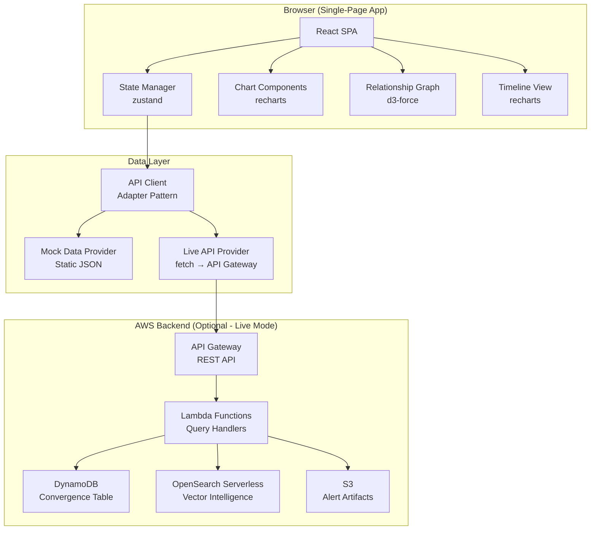
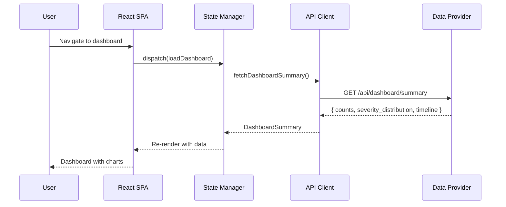
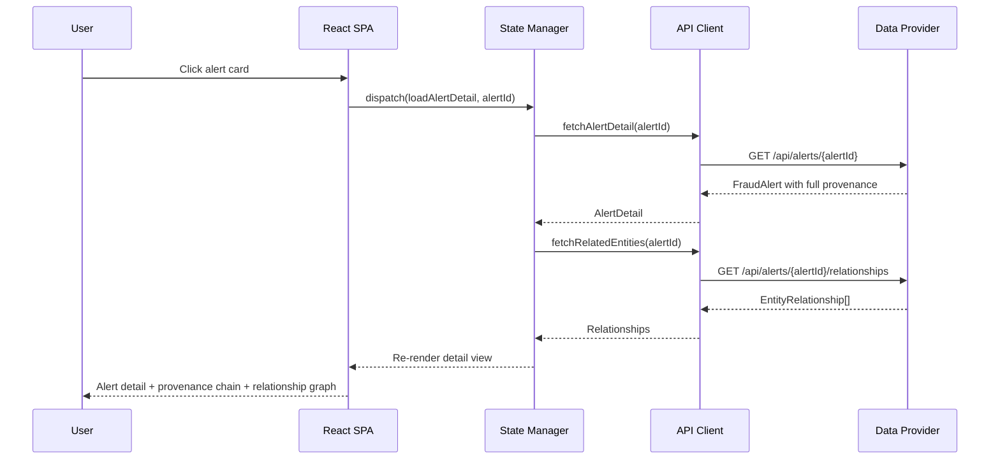
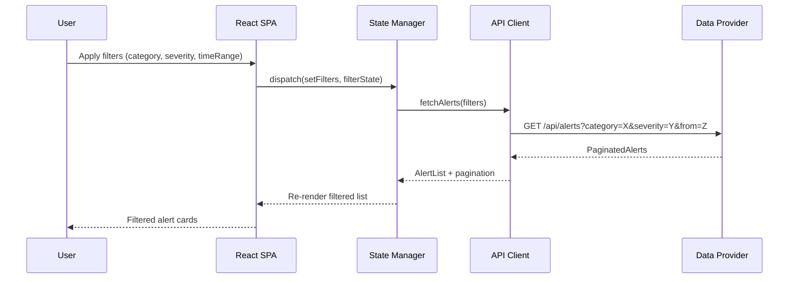

# Design Document: Fraud Intelligence Explorer

## Overview

The Fraud Intelligence Explorer is a single-page web application that provides a demo-quality interface for exploring intelligence produced by the Dark Web Fraud Agent pipeline. It visualizes fraud alerts, intelligence classifications, entity relationships, and full provenance chains — giving stakeholders a clear view of what the pipeline has discovered, how items are categorized, and the chain of evidence from raw dark web source to actionable alert.

The app is built as a static HTML/TypeScript/CSS application using React with a lightweight data layer that can read from either a live API (backed by API Gateway + Lambda querying DynamoDB/OpenSearch) or a bundled mock dataset for offline demos. The architecture prioritizes fast load times, clear data visualization, and zero-infrastructure demo capability.

## Architecture



## Sequence Diagrams

### Dashboard Load Flow



### Insight Detail with Provenance



### Filter and Browse Flow



## Components and Interfaces

### Component 1: DashboardView

**Purpose**: Top-level overview showing aggregate intelligence metrics, severity distribution, category breakdown, and a timeline of recent activity.

**Interface**:
```typescript
interface DashboardSummary {
  totalAlerts: number
  alertsBySeverity: Record<Severity, number>
  alertsByCategory: Record<FraudCategory, number>
  alertsByTier: Record<IntelligenceTier, number>
  timelineData: TimelinePoint[]
  recentAlerts: AlertSummary[]
  campaignCount: number
  activeSourceCount: number
}

interface TimelinePoint {
  timestamp: string  // ISO 8601
  count: number
  severity: Severity
}
```

**Responsibilities**:
- Render severity donut chart
- Render category bar chart
- Render 30-day activity timeline
- Show top-5 recent alerts as cards
- Display aggregate KPI tiles (total alerts, campaigns, sources)

### Component 2: AlertListView

**Purpose**: Filterable, sortable list of all intelligence alerts with faceted search.

**Interface**:
```typescript
interface AlertFilters {
  categories: FraudCategory[]
  severities: Severity[]
  tiers: IntelligenceTier[]
  timeRange: { from: string; to: string }
  searchText: string
  sortBy: 'created_at' | 'severity' | 'category'
  sortOrder: 'asc' | 'desc'
  page: number
  pageSize: number
}

interface PaginatedAlerts {
  alerts: AlertSummary[]
  totalCount: number
  page: number
  pageSize: number
  hasMore: boolean
}

interface AlertSummary {
  alertId: string
  alertType: AlertType
  severity: Severity
  category: FraudCategory
  tier: IntelligenceTier
  ttpDescription: string
  affectedInstitutions: string[]
  createdAt: string
  tagCount: number
}
```

**Responsibilities**:
- Render filter sidebar with multi-select facets
- Display paginated alert cards
- Handle sort toggling
- Provide full-text search across TTP descriptions
- Navigate to detail view on card click

### Component 3: AlertDetailView

**Purpose**: Full detail view for a single alert including provenance chain, detection rules, related intelligence, and entity relationships.

**Interface**:
```typescript
interface AlertDetail {
  alertId: string
  alertType: AlertType
  severity: Severity
  ttpDescription: string
  affectedInstitutions: string[]
  detectionRules: DetectionRule[]
  relatedIntelligence: string[]  // STIX IDs
  provenance: ProvenanceChain
  tags: MachineTag[]
  galaxyMatch: GalaxyMatch | null
  createdAt: string
}

interface ProvenanceChain {
  originalSourceUrl: string
  crawlTimestamp: string
  s3ArtifactKey: string
  processingChain: ProcessingStep[]
}

interface ProcessingStep {
  agentId: string
  agentName: string
  timestamp: string
  inputKey: string
  outputKey: string
  summary: string
}

interface DetectionRule {
  ruleType: 'yara' | 'sigma' | 'custom'
  ruleContent: string
  confidence: number
}

interface MachineTag {
  namespace: string
  predicate: string
  value: string
}

interface GalaxyMatch {
  galaxy: string
  clusterUuid: string
  clusterValue: string
  source: string
}
```

**Responsibilities**:
- Render provenance as a vertical stepper/timeline showing each pipeline stage
- Display detection rules with syntax-highlighted code blocks
- Show machine tags as colored badges grouped by namespace
- Render galaxy match info with link to MITRE reference
- List affected institutions as chips
- Display related STIX object IDs with tooltips

### Component 4: RelationshipGraphView

**Purpose**: Force-directed graph visualization showing connections between entities, TTPs, institutions, and threat actors.

**Interface**:
```typescript
interface GraphNode {
  id: string
  type: 'alert' | 'institution' | 'ttp' | 'entity' | 'campaign'
  label: string
  severity?: Severity
  metadata?: Record<string, string>
}

interface GraphEdge {
  source: string
  target: string
  relationship: string  // "affects" | "uses_ttp" | "part_of_campaign" | "related_to"
  weight: number
}

interface RelationshipGraph {
  nodes: GraphNode[]
  edges: GraphEdge[]
}
```

**Responsibilities**:
- Render force-directed graph with d3-force
- Color-code nodes by type
- Size nodes by connection count
- Show edge labels on hover
- Support zoom/pan navigation
- Filter graph by entity type
- Highlight selected node's connections

### Component 5: SignalSourcesView

**Purpose**: Display the raw signal sources that contributed to an insight, with confidence levels and source metadata.

**Interface**:
```typescript
interface SignalSource {
  sourceId: string
  sourceType: 'tor_hidden_service' | 'i2p_site' | 'telegram_channel' | 'forum_post' | 'marketplace'
  sourceUrl: string  // Redacted for display
  crawlTimestamp: string
  contentSnippet: string  // First 200 chars
  confidence: number
  entities: ExtractedEntity[]
  guardRailResult: 'PASSED' | 'FILTERED' | 'FLAGGED'
}

interface ExtractedEntity {
  entityType: string
  value: string
  context: string
  confidence: number
}
```

**Responsibilities**:
- List signal sources as expandable cards
- Show confidence as a color-coded progress bar
- Display extracted entities per source
- Show guardrail status badge
- Redact sensitive URLs for demo safety

## Data Models

### Core Type Definitions

```typescript
type Severity = 'low' | 'medium' | 'high' | 'critical'
type AlertType = 'ttp_alert' | 'campaign_alert' | 'summary_digest'
type IntelligenceTier = 'observable' | 'indicator' | 'ttp'

type FraudCategory =
  | 'mfa_bypass'
  | 'synthetic_identity'
  | 'phishing_kit'
  | 'cnp_fraud'
  | 'account_takeover'
  | 'new_account_fraud'
  | 'recurring_billing_fraud'
  | 'money_mule'
  | 'investment_fraud'
  | 'social_engineering'

type SourceType =
  | 'tor_hidden_service'
  | 'i2p_site'
  | 'telegram_channel'
  | 'forum_post'
  | 'marketplace'
```

**Validation Rules**:
- `severity` must be one of the four severity levels
- `confidence` values must be in range [0.0, 1.0]
- `createdAt` must be a valid ISO 8601 timestamp
- `alertId` must be a non-empty string (UUID format)
- `page` must be >= 1, `pageSize` must be in [10, 100]

### API Response Envelope

```typescript
interface ApiResponse<T> {
  data: T
  meta: {
    requestId: string
    timestamp: string
    dataSource: 'live' | 'mock'
  }
  error?: {
    code: string
    message: string
  }
}
```

## Algorithmic Pseudocode

### Dashboard Aggregation Algorithm

```typescript
function computeDashboardSummary(alerts: AlertDetail[]): DashboardSummary {
  // Precondition: alerts is a valid array (may be empty)
  // Postcondition: returns summary with correct counts matching input data

  const alertsBySeverity: Record<Severity, number> = {
    low: 0, medium: 0, high: 0, critical: 0
  }
  const alertsByCategory: Record<string, number> = {}
  const alertsByTier: Record<string, number> = {}
  const timelineMap: Map<string, { count: number; severity: Severity }> = new Map()

  for (const alert of alerts) {
    // Loop invariant: all previously counted alerts have valid severity/category
    alertsBySeverity[alert.severity]++
    alertsByCategory[alert.category] = (alertsByCategory[alert.category] ?? 0) + 1
    alertsByTier[alert.tier] = (alertsByTier[alert.tier] ?? 0) + 1

    const dateKey = alert.createdAt.substring(0, 10) // YYYY-MM-DD
    const existing = timelineMap.get(dateKey)
    if (existing) {
      existing.count++
    } else {
      timelineMap.set(dateKey, { count: 1, severity: alert.severity })
    }
  }

  const timelineData = Array.from(timelineMap.entries())
    .map(([timestamp, data]) => ({ timestamp, ...data }))
    .sort((a, b) => a.timestamp.localeCompare(b.timestamp))

  return {
    totalAlerts: alerts.length,
    alertsBySeverity,
    alertsByCategory,
    alertsByTier,
    timelineData,
    recentAlerts: alerts.slice(0, 5),
    campaignCount: alerts.filter(a => a.alertType === 'campaign_alert').length,
    activeSourceCount: new Set(alerts.map(a => a.provenance.originalSourceUrl)).size,
  }
}
```

**Preconditions:**
- `alerts` array contains valid AlertDetail objects
- Each alert has valid severity, category, tier, and createdAt fields

**Postconditions:**
- `totalAlerts` equals `alerts.length`
- Sum of `alertsBySeverity` values equals `totalAlerts`
- `timelineData` is sorted chronologically
- `recentAlerts` contains at most 5 items

### Filter Application Algorithm

```typescript
function applyFilters(alerts: AlertSummary[], filters: AlertFilters): AlertSummary[] {
  // Precondition: alerts is a valid array, filters has valid field values
  // Postcondition: result is a subset of alerts matching ALL filter criteria

  let filtered = alerts

  if (filters.categories.length > 0) {
    filtered = filtered.filter(a => filters.categories.includes(a.category))
  }

  if (filters.severities.length > 0) {
    filtered = filtered.filter(a => filters.severities.includes(a.severity))
  }

  if (filters.tiers.length > 0) {
    filtered = filtered.filter(a => filters.tiers.includes(a.tier))
  }

  if (filters.timeRange.from) {
    filtered = filtered.filter(a => a.createdAt >= filters.timeRange.from)
  }

  if (filters.timeRange.to) {
    filtered = filtered.filter(a => a.createdAt <= filters.timeRange.to)
  }

  if (filters.searchText) {
    const search = filters.searchText.toLowerCase()
    filtered = filtered.filter(a =>
      a.ttpDescription.toLowerCase().includes(search) ||
      a.affectedInstitutions.some(i => i.toLowerCase().includes(search))
    )
  }

  // Sort
  filtered.sort((a, b) => {
    const cmp = compareField(a, b, filters.sortBy)
    return filters.sortOrder === 'asc' ? cmp : -cmp
  })

  return filtered
}
```

**Preconditions:**
- `alerts` contains valid AlertSummary objects
- `filters.categories` contains only valid FraudCategory values
- `filters.severities` contains only valid Severity values
- `filters.timeRange.from` <= `filters.timeRange.to` (if both provided)

**Postconditions:**
- Every item in result satisfies ALL active filter conditions
- Result is sorted according to `sortBy` and `sortOrder`
- Result length <= input `alerts` length

### Relationship Graph Construction Algorithm

```typescript
function buildRelationshipGraph(
  alerts: AlertDetail[],
  maxNodes: number = 100
): RelationshipGraph {
  // Precondition: alerts is non-empty, maxNodes > 0
  // Postcondition: graph is connected (no orphan nodes), node count <= maxNodes

  const nodes: Map<string, GraphNode> = new Map()
  const edges: GraphEdge[] = []

  for (const alert of alerts) {
    // Add alert node
    const alertNodeId = `alert:${alert.alertId}`
    nodes.set(alertNodeId, {
      id: alertNodeId,
      type: 'alert',
      label: alert.ttpDescription.substring(0, 40),
      severity: alert.severity,
    })

    // Add institution nodes and edges
    for (const institution of alert.affectedInstitutions) {
      const instNodeId = `institution:${institution.toLowerCase()}`
      if (!nodes.has(instNodeId)) {
        nodes.set(instNodeId, {
          id: instNodeId,
          type: 'institution',
          label: institution,
        })
      }
      edges.push({
        source: alertNodeId,
        target: instNodeId,
        relationship: 'affects',
        weight: severityWeight(alert.severity),
      })
    }

    // Add TTP nodes from tags
    for (const tag of alert.tags) {
      if (tag.namespace === 'mitre-attack' && tag.predicate === 'technique') {
        const ttpNodeId = `ttp:${tag.value}`
        if (!nodes.has(ttpNodeId)) {
          nodes.set(ttpNodeId, {
            id: ttpNodeId,
            type: 'ttp',
            label: `ATT&CK ${tag.value}`,
          })
        }
        edges.push({
          source: alertNodeId,
          target: ttpNodeId,
          relationship: 'uses_ttp',
          weight: 1,
        })
      }
    }

    // Campaign grouping
    if (alert.alertType === 'campaign_alert' && alert.galaxyMatch) {
      const campaignNodeId = `campaign:${alert.galaxyMatch.clusterUuid}`
      if (!nodes.has(campaignNodeId)) {
        nodes.set(campaignNodeId, {
          id: campaignNodeId,
          type: 'campaign',
          label: alert.galaxyMatch.clusterValue,
        })
      }
      edges.push({
        source: alertNodeId,
        target: campaignNodeId,
        relationship: 'part_of_campaign',
        weight: 2,
      })
    }
  }

  // Prune to maxNodes — keep highest-connected nodes
  const nodeArray = Array.from(nodes.values())
  if (nodeArray.length > maxNodes) {
    const connectionCount = new Map<string, number>()
    for (const edge of edges) {
      connectionCount.set(edge.source, (connectionCount.get(edge.source) ?? 0) + 1)
      connectionCount.set(edge.target, (connectionCount.get(edge.target) ?? 0) + 1)
    }
    nodeArray.sort((a, b) =>
      (connectionCount.get(b.id) ?? 0) - (connectionCount.get(a.id) ?? 0)
    )
    const keepIds = new Set(nodeArray.slice(0, maxNodes).map(n => n.id))
    return {
      nodes: nodeArray.filter(n => keepIds.has(n.id)),
      edges: edges.filter(e => keepIds.has(e.source) && keepIds.has(e.target)),
    }
  }

  return { nodes: nodeArray, edges }
}
```

**Preconditions:**
- `alerts` is non-empty with valid AlertDetail objects
- `maxNodes` is a positive integer

**Postconditions:**
- All edges reference existing nodes in the result
- Node count does not exceed `maxNodes`
- No duplicate node IDs in result
- Graph preserves highest-connected nodes when pruning

**Loop Invariants:**
- After processing each alert: all nodes referenced by edges exist in the `nodes` map
- Institution nodes are deduplicated by lowercase name

## Key Functions with Formal Specifications

### Data Provider Interface

```typescript
interface DataProvider {
  fetchDashboardSummary(): Promise<DashboardSummary>
  fetchAlerts(filters: AlertFilters): Promise<PaginatedAlerts>
  fetchAlertDetail(alertId: string): Promise<AlertDetail>
  fetchRelationships(alertId: string): Promise<RelationshipGraph>
  fetchSignalSources(alertId: string): Promise<SignalSource[]>
}
```

**Preconditions (all methods):**
- Provider is initialized and connected (mock or live)
- For live provider: valid API Gateway endpoint is configured

**Postconditions (all methods):**
- Returns valid typed response matching interface
- Throws `ApiError` on failure with descriptive message
- Never returns `undefined` — returns empty collections when no data

### Mock Data Provider

```typescript
function createMockDataProvider(mockData: MockDataset): DataProvider
```

**Preconditions:**
- `mockData` contains valid AlertDetail[], DashboardSummary, and RelationshipGraph
- Mock dataset has at least 10 alerts spanning multiple categories and severities

**Postconditions:**
- All DataProvider methods return deterministic results from mock dataset
- Filter operations correctly filter the mock dataset
- Pagination works correctly on mock data
- No network calls are made

### Live API Provider

```typescript
function createLiveDataProvider(config: { baseUrl: string; apiKey?: string }): DataProvider
```

**Preconditions:**
- `config.baseUrl` is a valid URL pointing to API Gateway
- If `apiKey` provided, it must be a valid API Gateway key

**Postconditions:**
- All methods make HTTP requests to the configured endpoint
- Responses are validated against expected types before returning
- Network errors are wrapped in `ApiError` with retry guidance
- Request timeout is enforced (30s default)

## Example Usage

```typescript
// Initialize the app with mock data for demos
import { createMockDataProvider } from './data/mockProvider'
import { createApp } from './app'
import mockData from './data/mockDataset.json'

const provider = createMockDataProvider(mockData)
const app = createApp({ dataProvider: provider })

// Dashboard view retrieves summary
const summary = await provider.fetchDashboardSummary()
// summary.totalAlerts → 47
// summary.alertsBySeverity → { low: 12, medium: 18, high: 13, critical: 4 }

// Filter alerts by category
const filters: AlertFilters = {
  categories: ['account_takeover', 'mfa_bypass'],
  severities: ['high', 'critical'],
  tiers: [],
  timeRange: { from: '2025-01-01', to: '2025-07-01' },
  searchText: '',
  sortBy: 'severity',
  sortOrder: 'desc',
  page: 1,
  pageSize: 20,
}
const results = await provider.fetchAlerts(filters)
// results.alerts → AlertSummary[] matching criteria

// View alert detail with provenance
const detail = await provider.fetchAlertDetail('alert-001')
// detail.provenance.processingChain →
//   [CrawlingEngine → ContentAnalyst → DataStructurer → TaggingEngine → AlertGenerator]

// Build relationship graph for visualization
const graph = await provider.fetchRelationships('alert-001')
// graph.nodes → [{type: 'alert'}, {type: 'institution', label: 'HSBC'}, ...]
// graph.edges → [{source: 'alert:001', target: 'institution:hsbc', relationship: 'affects'}]
```

## Correctness Properties

*A property is a characteristic or behavior that should hold true across all valid executions of a system — essentially, a formal statement about what the system should do. Properties serve as the bridge between human-readable specifications and machine-verifiable correctness guarantees.*

### Property 1: Severity distribution sums to total

*For any* valid array of alerts, computing the dashboard summary SHALL produce severity distribution counts whose sum equals the total alert count.

**Validates: Requirements 1.6, 8.1, 8.2**

### Property 2: Filter result is always a subset of input

*For any* alert array and any combination of filter criteria, the filtered result SHALL be a subset of the input — every alert in the output must exist in the original input.

**Validates: Requirements 9.6**

### Property 3: Filter determinism (idempotency)

*For any* alert array and any filter configuration, applying the same filters to the same input SHALL always produce the same output.

**Validates: Requirements 9.7**

### Property 4: Category filter correctness

*For any* alert array and any non-empty set of selected categories, every alert in the filtered result SHALL have its category contained in the selected categories set.

**Validates: Requirements 2.1, 9.1**

### Property 5: Severity filter correctness

*For any* alert array and any non-empty set of selected severities, every alert in the filtered result SHALL have its severity contained in the selected severities set.

**Validates: Requirements 2.2, 9.2**

### Property 6: Time range filter correctness

*For any* alert array and any valid time range [from, to], every alert in the filtered result SHALL have a createdAt value >= from AND <= to.

**Validates: Requirements 2.4, 9.3**

### Property 7: Text search filter correctness

*For any* alert array and any non-empty search string, every alert in the filtered result SHALL contain the search string (case-insensitive) in either its TTP description or at least one affected institution name.

**Validates: Requirements 2.5, 9.4**

### Property 8: Filter AND-composition

*For any* alert array with multiple active filter types, the combined filter result SHALL equal the intersection of applying each filter type individually.

**Validates: Requirements 2.6, 9.5**

### Property 9: Empty filter returns all

*For any* alert array, applying filters with no active criteria (empty categories, empty severities, empty tiers, no time range, empty search text) SHALL return the complete input array.

**Validates: Requirements 2.7**

### Property 10: Sort ordering correctness

*For any* alert array and any valid sort field and direction, consecutive pairs in the sorted result SHALL be ordered according to the specified field and direction.

**Validates: Requirements 2.8**

### Property 11: Pagination disjointness and completeness

*For any* paginated result set, the union of alerts across all pages SHALL equal the full filtered result set, and no alert SHALL appear on more than one page.

**Validates: Requirements 2.9, 2.10**

### Property 12: Graph edge integrity

*For any* constructed relationship graph (before or after pruning), every edge's source and target SHALL reference a node ID that exists in the final node list.

**Validates: Requirements 4.8, 10.6, 10.7**

### Property 13: Graph node deduplication

*For any* input data containing institution names that differ only in case, the constructed graph SHALL produce exactly one institution node per unique lowercase name.

**Validates: Requirements 10.2**

### Property 14: TTP node source constraint

*For any* constructed graph, every TTP-type node SHALL correspond to a tag with namespace "mitre-attack" and predicate "technique" from the input data.

**Validates: Requirements 10.3**

### Property 15: Campaign node prerequisite

*For any* constructed graph, every campaign-type node SHALL correspond to an alert with alertType "campaign_alert" and a non-null GalaxyMatch.

**Validates: Requirements 10.4**

### Property 16: Graph pruning retains most-connected nodes

*For any* input data producing more than maxNodes nodes, the pruned graph SHALL contain exactly maxNodes nodes, and every retained node SHALL have a connection count greater than or equal to every pruned node's connection count.

**Validates: Requirements 4.7, 10.5**

### Property 17: URL redaction removes path

*For any* dark web source URL, the redaction function SHALL output only the domain portion with no path, query, or fragment components.

**Validates: Requirements 5.5**

### Property 18: Timeline chronological ordering

*For any* alert array, the computed timeline points SHALL be sorted in non-decreasing chronological order by timestamp.

**Validates: Requirements 8.3**

### Property 19: Campaign count accuracy

*For any* alert array, the computed campaign count SHALL equal the number of alerts in the input with alertType equal to "campaign_alert".

**Validates: Requirements 8.4**

### Property 20: Active source count accuracy

*For any* alert array, the computed active source count SHALL equal the number of distinct originalSourceUrl values across all alerts' provenance records.

**Validates: Requirements 8.5**

### Property 21: Validation rejects invalid severity

*For any* string that is not one of "low", "medium", "high", "critical", the validation function SHALL reject the input with a descriptive error.

**Validates: Requirements 11.1, 11.6**

### Property 22: Validation rejects out-of-range confidence

*For any* number less than 0.0 or greater than 1.0, the validation function SHALL reject the input with a descriptive error.

**Validates: Requirements 11.2, 11.6**

### Property 23: Validation rejects invalid pagination parameters

*For any* page value less than 1 or pageSize value outside [10, 100], the validation function SHALL reject the input with a descriptive error.

**Validates: Requirements 11.5, 11.6**

### Property 24: Tag grouping by namespace

*For any* set of MachineTag values, the grouping function SHALL produce groups where every tag within a group shares the same namespace, and every tag appears in exactly one group.

**Validates: Requirements 3.5**

### Property 25: API response envelope structure

*For any* data provider response, the result SHALL be wrapped in an ApiResponse envelope containing a data field, a meta field with requestId, timestamp, and dataSource, and the dataSource value SHALL match the configured provider type.

**Validates: Requirements 6.5, 7.4**

## Error Handling

### Error Scenario 1: API Unavailable

**Condition**: Live API endpoint returns 5xx or network timeout
**Response**: Display cached data with "Data may be stale" banner; retry with exponential backoff (1s, 2s, 4s, max 30s)
**Recovery**: Auto-retry in background; update UI when fresh data arrives; offer manual refresh button

### Error Scenario 2: Invalid Alert ID

**Condition**: User navigates to `/alerts/{id}` with non-existent ID
**Response**: Show "Alert not found" message with link back to alert list
**Recovery**: No retry needed; user navigates elsewhere

### Error Scenario 3: Mock Data Corruption

**Condition**: Mock JSON file is malformed or missing required fields
**Response**: Show error boundary with "Demo data unavailable" message
**Recovery**: Fall back to minimal hardcoded sample data (3 alerts) to keep app functional

### Error Scenario 4: Graph Too Large

**Condition**: Relationship graph exceeds maxNodes threshold (>100 nodes)
**Response**: Prune graph to top-100 most-connected nodes; show "Showing top 100 connections" indicator
**Recovery**: Provide filter controls to narrow graph scope; offer "show all" option with performance warning

## Testing Strategy

### Unit Testing Approach

- **Framework**: Vitest + React Testing Library
- **Coverage target**: 80% line coverage on data transformation logic
- **Key test cases**:
  - `computeDashboardSummary` with empty array, single alert, 100+ alerts
  - `applyFilters` with each filter combination and edge cases (empty categories, future dates)
  - `buildRelationshipGraph` with various alert configurations and pruning threshold
  - Component rendering with mock props (each view component)
  - Data provider adapter switching between mock and live modes

### Property-Based Testing Approach

- **Library**: fast-check
- **Properties**:
  - For any valid AlertDetail[], `computeDashboardSummary` severity counts sum to total
  - For any filter subset, result is always a subset of input
  - `buildRelationshipGraph` never produces edges referencing non-existent nodes
  - Pagination: union of all pages equals full result set, pages are disjoint

### Integration Testing Approach

- E2E tests with Playwright verifying:
  - Dashboard loads and displays charts
  - Filter application reduces visible alerts
  - Alert detail shows provenance chain
  - Graph visualization renders nodes and edges
  - Navigation between views preserves filter state

## Performance Considerations

- **Initial load**: Target < 2s for dashboard with mock data; lazy-load chart libraries
- **Bundle size**: Code-split per view (dashboard, list, detail, graph) using React.lazy
- **Graph rendering**: Limit to 100 nodes by default; use web workers for force simulation on large graphs
- **Pagination**: Server-side pagination for live mode; client-side for mock mode (dataset < 1000 alerts)
- **Caching**: Cache API responses for 60s in zustand store to avoid redundant fetches during navigation

## Security Considerations

- **URL redaction**: Dark web source URLs are partially redacted in the UI (show domain only, not full path)
- **Content sanitization**: All text from backend is sanitized before rendering (no dangerouslySetInnerHTML)
- **API key handling**: API key stored in environment variable, never exposed in client bundle for demo builds
- **CORS**: API Gateway configured with restrictive CORS (specific origin in production)
- **No PII display**: Alert data does not contain PII; entity values like BTC wallets and IPs are intelligence data, not personal data

## Dependencies

| Package | Purpose | Version |
|---------|---------|---------|
| react | UI framework | ^18.3 |
| react-dom | DOM rendering | ^18.3 |
| react-router-dom | Client-side routing | ^6.x |
| zustand | Lightweight state management | ^4.x |
| recharts | Charts (donut, bar, timeline) | ^2.x |
| d3-force | Force-directed graph simulation | ^3.x |
| @tanstack/react-query | Data fetching + caching | ^5.x |
| tailwindcss | Utility-first CSS | ^3.x |
| vite | Build tool + dev server | ^5.x |
| vitest | Unit testing | ^1.x |
| fast-check | Property-based testing | ^3.x |
| @testing-library/react | Component testing | ^14.x |
| playwright | E2E testing | ^1.x |
